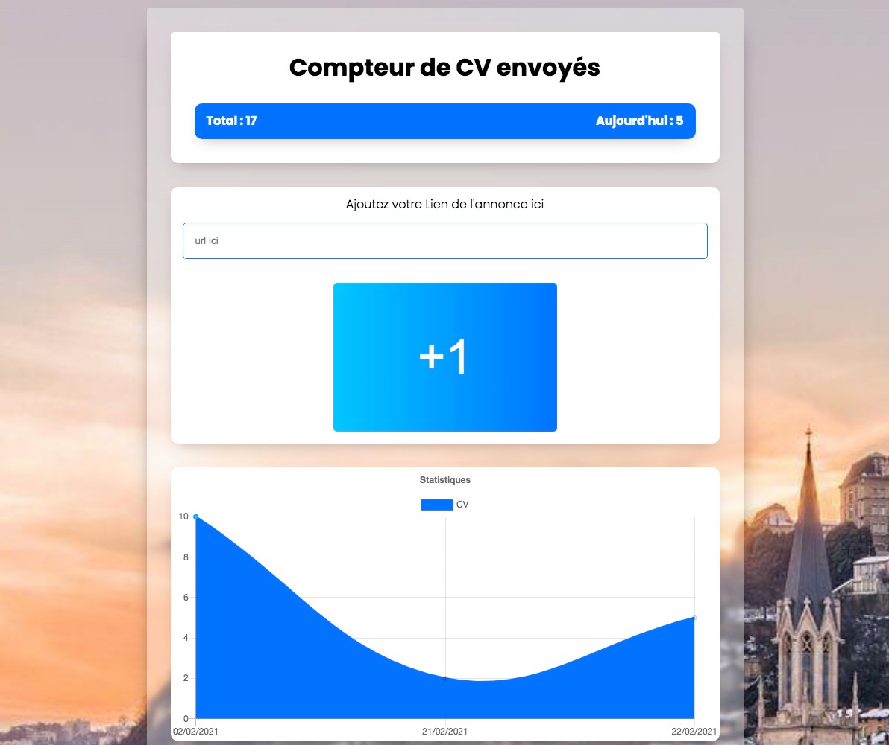

## About The Project 
# Cv counter

un compteur de cv envoyés
[](https://app.netlify.com/sites/cv-counter/deploys)


https://cv-counter.netlify.app
### Built With

* :fr: React
* 🐙 Github
* 💻 VS Code

<!-- GETTING STARTED -->
## Getting Started

To get a local copy up and running follow these simple steps.

### Prerequisites

This is an example of how to list things you need to use the software and how to install them.
* Git
```sh
sudo apt-get install git
```

Clone this repo 

Then install react with cli
```sh
yarn
```
Launch server with
```sh
yarn start
```
Go to http://localhost:8080

Enjoy !

## Usage

You can grab this code, and try yourself this small App :)


<!-- CONTACT -->
## Contact

Basseguy Dimitri - [https://www.linkedin.com/in/dimitri-basseguy/](https://www.linkedin.com/in/dimitri-basseguy/) - dimitri.basseguy@gmail.com

<!-- ACKNOWLEDGEMENTS -->
## Acknowledgements

* Stay safe.
